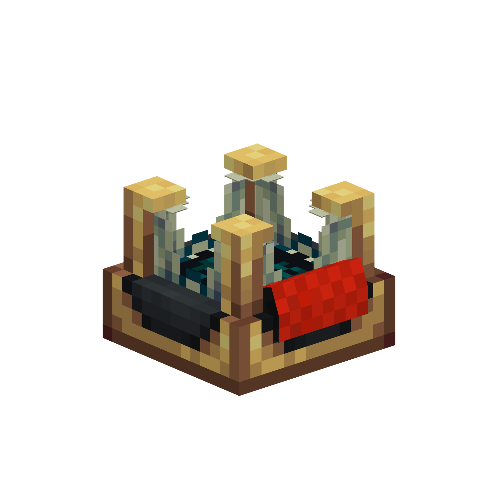
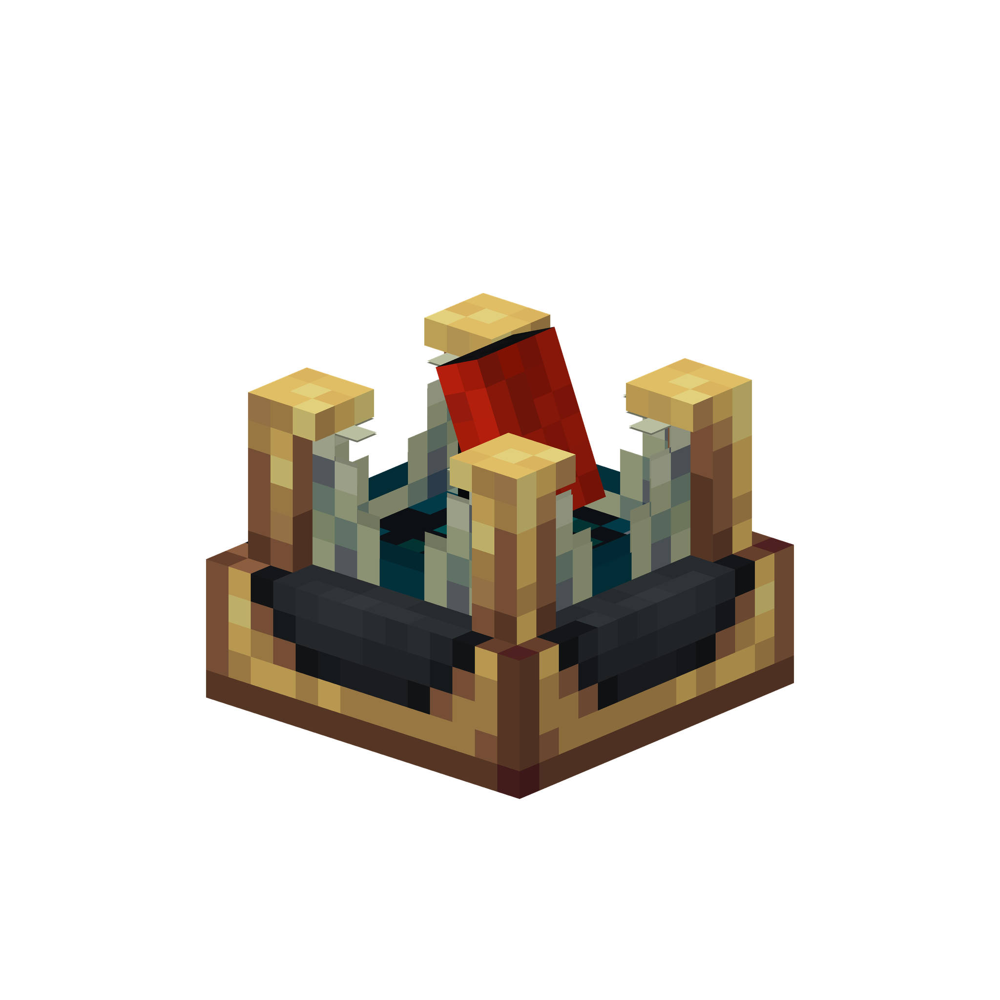

# Create: Echo Radars

**Explore what lies beneath the surface.** Create: Echo Radars brings underwater sonar to Minecraft 1.21.1, connecting acoustic scans to Create: Radars networks, monitors, and sonar glass.

  
  

## About Create: Echo Radars

The mod brings together three parts:

- **Underwater scanning.** The Forward-looking Sonar looks ahead, the Echo Sounder looks below, and the Side-scan Sonar records echoes on both sides. The Mechanical Imaging Sonar rotates to scan its surroundings and runs on Create rotational power supplied to the shaft on its base. The other sonars need no rotational power.
- **Create: Radars integration.** Connect a submerged sonar to a Network Filterer and monitor with Data Links. Configure range, field of view, and tilt; watch echoes, detected targets, and acoustic shadows appear on the display. Wider fields of view can reduce the available range.
- **Sonar glass.** Copper and Iron Sonar Glass form connected display windows. Feed a window one signal directly, or use a Sonar Signal Summator to combine up to four signals. Place the summator within 16 blocks of the selected window.

Client settings control the monitor palette, gain, speckle, and sonar glass display. Server settings control scanning and performance limits.

## Dependencies

- Minecraft **1.21.1** with [NeoForge](https://neoforged.net/)
- [Create](https://www.curseforge.com/minecraft/mc-mods/create) 6.0.10 or newer, below 6.1.0
- [Create: Radars](https://www.curseforge.com/minecraft/mc-mods/create-radars) 0.4.9.4 or newer, below 6.0.0
- [YetAnotherConfigLib (YACL)](https://www.curseforge.com/minecraft/mc-mods/yacl) 3.8.2 or newer on the client, for the configuration screen

## Mod support

- [Sable](https://www.curseforge.com/minecraft/mc-mods/sable) 1.2.1+ — scan moving contraptions and keep links connected when they move.
- [CBC Military Supplement](https://www.curseforge.com/minecraft/mc-mods/cbcms) 2.1.4–2.1.x — guide torpedoes equipped with a Create: Radars Guided Fuze.
- [Veil](https://www.curseforge.com/minecraft/mc-mods/veil-lib) 4.0.0+ — use the alternative sonar glass renderer. A compatible renderer is available without Veil.
- [Fusion](https://www.curseforge.com/minecraft/mc-mods/fusion-connected-textures) 1.2.12+ — connected textures for sonar glass frames.
- [Copycats](https://www.curseforge.com/minecraft/mc-mods/copycats) — use sonar glass as a material for compatible Copycats shapes.

## Credits

- **Drakon7009** — mod author.
- **chakchak777** and **ken_flish** — textures.
